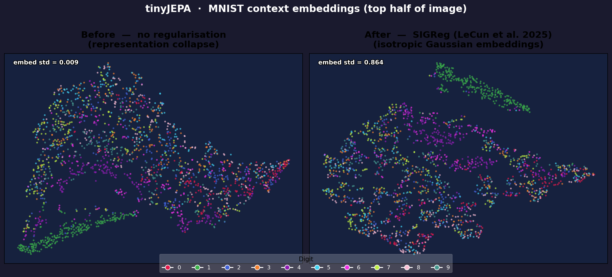

# tinyJEPA

A minimal implementation of Joint-Embedding Predictive Architecture (JEPA) trained on MNIST, built from scratch to understand self-supervised representation learning.

---

## Day 1 — Building the foundation & fixing representation collapse

We built a minimal JEPA on MNIST: a small ConvNet encoder (27K params) maps the top half of each image to a 128-d embedding, a 2-layer MLP predictor (66K params) maps that to a predicted embedding, and an EMA target encoder encodes the bottom half for the MSE target. The first problem we hit was **representation collapse** — without any regularisation both encoders converge to near-zero outputs within the first hundred batches, MSE hits zero trivially, and a linear probe scores only 34% (barely above random).

The fix is **SIGReg** (LeCun et al., [arXiv 2603.19312](https://arxiv.org/abs/2603.19312)), which projects the encoder's output onto 64 random directions and minimises the Epps-Pulley test statistic on each 1-D slice, forcing the full embedding distribution toward $\mathcal{N}(0, I)$. Applied directly to `ctx_embed` with $\lambda = 0.1$, embedding std rises from 0.009 to 0.864 and the linear probe reaches **48%** after 15 epochs.

---

## Files

| File | Purpose |
|------|---------|
| `classes.py` | `Encoder` and `Predictor` model definitions |
| `main.py` | Training loop with SIGReg |
| `use_encoder.py` | Load saved encoder and run linear probe |
| `visualize_collapse.py` | Train both models and generate the t-SNE comparison plot |
| `tiny_jepa_encoder.pt` | Saved encoder weights (SIGReg, 15 epochs) |
| `assets/day1/embedding_collapse.png` | Before/after collapse visualisation |
